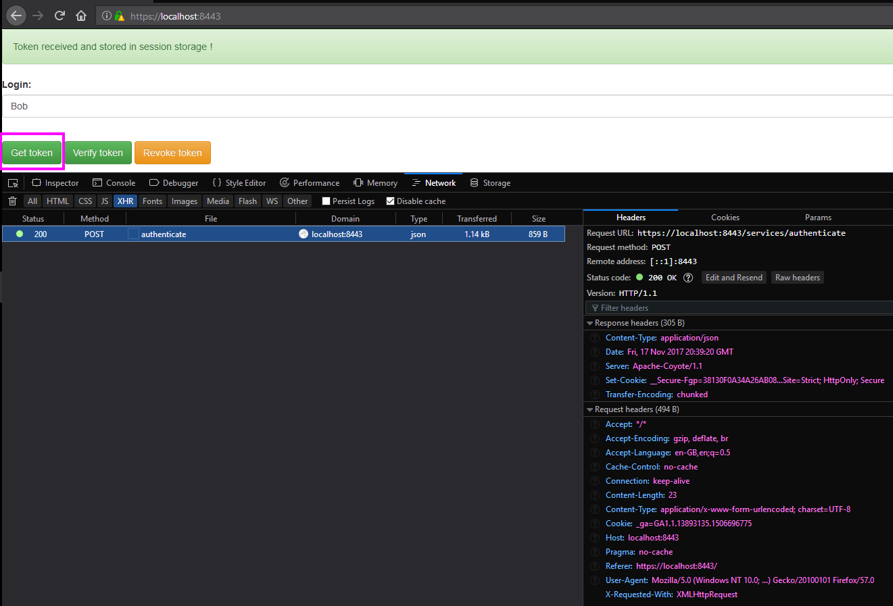
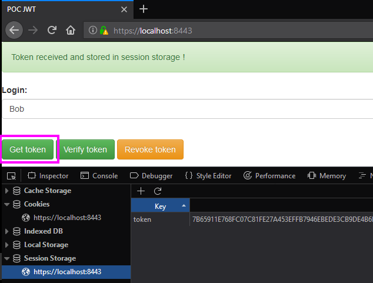
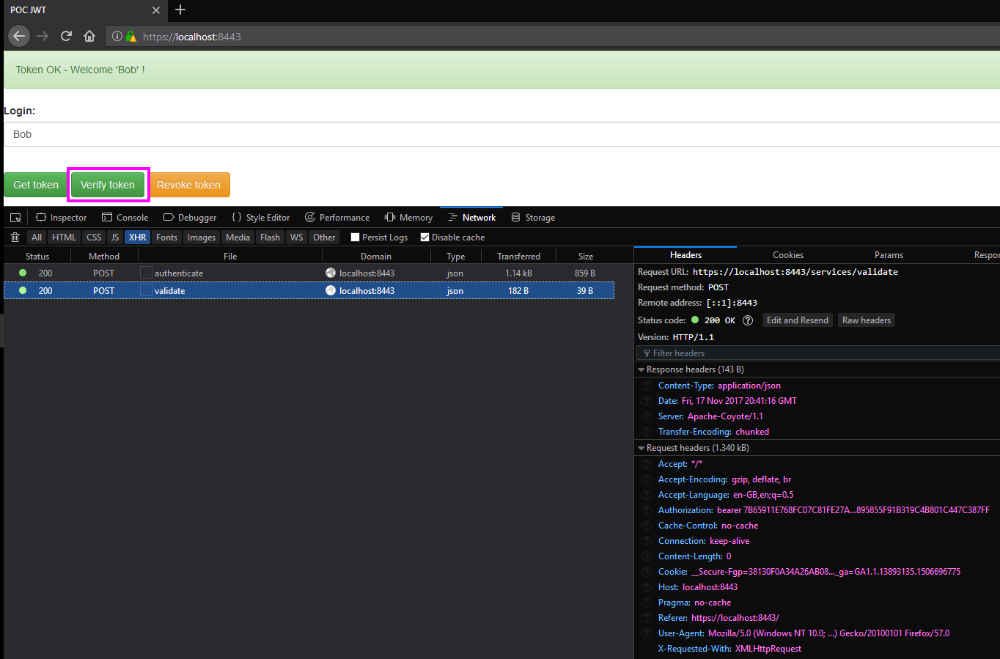

# Introduction

It's the code repository of the OWASP cheatsheet [JSON Web Token (JWT) Cheat Sheet for Java](https://www.owasp.org/index.php/JSON_Web_Token_(JWT)_Cheat_Sheet_for_Java).

A web page propose the creation, validation and revocation of the token, see the image below:

Get a token:



Token stored in browser session storage:



Associated user fingerprint hardened cookie issued to tackle token sidejacking:


Verification of the token:



Revocation of the token (logout):


Verification of the token indicating that the token has been revoked and is not valid anymore:


All classes are fully documented.

The project was developed with JAX-RS + Maven under IntelliJ IDEA Community Edition.

# Build status

[](https://travis-ci.org/righettod/poc-jwt)

# Build or Run

You can also use the **Run Application** running configuration from Intellij project.

Run the following command to create a WAR archive:
```
mvn clean package
```

Run the following command to run the prototype (application will be available on https://localhost:8443):
```
mvn tomcat7:run-war
```

# Pending work on the project and the cheatsheets

- [x] Add importance of a "logout" and how to implement it.
- [x] Move the fingerprint as hardened cookie generated by the server (random) in order to tackle XSS and Privacy.
- [x] Indicate that any token stored in session/local storage can be steal by XSS and so CSP must be added.
- [x] Indicate that cookie can be used to store the token but in this case, HTTPOnly/Secure/SameSite flag must be added along CSRF protection on server side.
- [x] Indicate that JWT is not the universal solution and for application that do no need to be fully stateless then "traditional" session sytem can be used (with a hardened cookie).
- [ ] Wait review before to update the cheatsheet.
